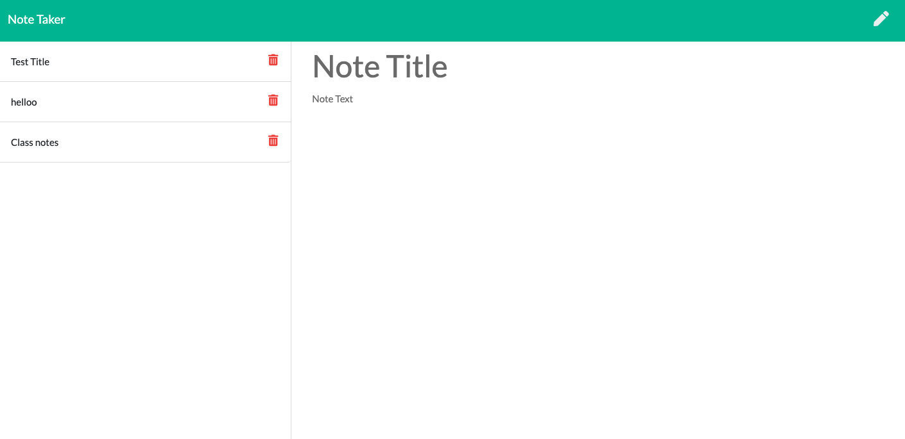

# Note Taker

## Description

An application that can be used to write, save, and delete notes. This application will use an express backend and save and retrieve note data from a JSON file.


## User Story


```

AS A user, I want to be able to write and save notes

I WANT to be able to delete notes I've written before

SO THAT I can organize my thoughts and keep track of tasks I need to complete

```

## Demo Screenshots



## Deployment

You are required to submit the following:

* The URL of the deployed application: https://infinite-mesa-15148.herokuapp.com/

* The URL of the GitHub repository: https://github.com/betielbetu/Note-Taker

- - -
© 2021 Betiel Mengesha. All Rights Reserved.
